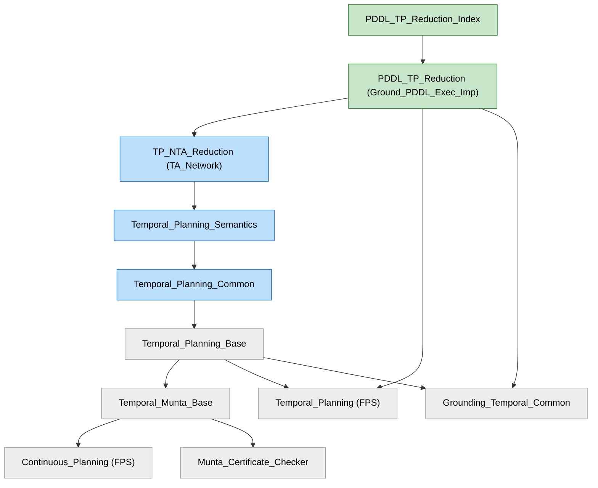

# Dependency diagram — sessions, theories, and the executable/numeric split

Reflects the post-reorganization layout (2026-07-05). The `TA_Network` reduction is now split into a
**propositional kernel** and a **numeric layer** on top of it, with generic helpers factored into a
`Utils` theory. All theory files are flat in `TA_Network/` (a single session); the `Numeric_` naming
prefix distinguishes the layers (see §4).

Arrows point **from a node to what it depends on** (`A --> B` = "A imports B").

## Legend
- 🟩 **executable** — on the `export_code` path (propositional net, code-generated to SML).
- 🟦 **proof-only** — abstract/locale correctness; no code generation.
- 🟥 **missing** — would be needed for an executable *numeric* checker; not built.
- ⬜ **external** — dependency session (Munta, FPS, grounder, HOL-IMP).

---

## 1. Session dependency graph



`Temporal_Planning_Base` is the prebuilt heap launched in jEdit (`-l Temporal_Planning_Base`).

---

## 2. `TP_NTA_Reduction` theory chain (TA_Network) — post-reorg

**Propositional kernel** (top imports those below):
```
TP_NTA_Reduction_Correctness          (top; capstone: valid_plan_imp_form_holds)
TP_NTA_Reduction_Steps                (per-phase feasibility + plan-stepping defs)
TP_NTA_Reduction_Properties           (general automaton props + constraint-satisfaction
                                        lemmas + steps_seq + invariant-maintenance)
TP_NTA_Reduction_Happenings           (conditions / state-predicates + I/E/D rules ONLY)
TP_NTA_Reduction_Edges                (edge effects + boundedness + run-construction)
TP_NTA_Reduction_Prelims              (equivalence to planning semantics)
TP_NTA_Reduction_Utils                (generic pure-HOL + Munta-global helper lemmas)
TP_NTA_Reduction_Model_Checking       (naming locales, a0, sublocales)
TP_NTA_Reduction_Defs                 (propositional reduction defs)
NTA_Temp_Planning_Sem                 (semantics bridge)
```

**Numeric layer** (sits on the propositional top; a tightly-coupled lifting pipeline, *not*
re-layered like the kernel — conditions/step-props are consumed by numeric Edges/Projection, so they
stay in Prelims/Edges):
```
TP_NTA_Reduction_Correctness_Numeric  (top; num_valid_plan_imp_form_holds + num_happening_steps_possible)
TP_NTA_Reduction_Numeric_Steps        (per-phase lifts; was PhaseLifts)
TP_NTA_Reduction_Numeric_Projection   (store decomposition + run-lift engine; no prop twin)
TP_NTA_Reduction_Numeric_Edges        (numeric step infra + non-interference; was StepInfra)
TP_NTA_Reduction_Numeric_Prelims      (tracking + faithfulness + numeric conditions; was Tracking)
TP_NTA_Reduction_Numeric_Model_Checking (numeric correctness locale + sublocales + num_a0)
TP_NTA_Reduction_Numeric_Defs         (numeric reduction locales; split from prop Defs)
```
Naming: `Correctness` appears only on the two capstone files (`…_Correctness`,
`…_Correctness_Numeric`); every stage file is `TP_NTA_Reduction_[Numeric_]<Stage>`.

---

## 3. The executable / numeric gap (unchanged by the reorg) — see [NUMERIC_EXEC_PLAN.md](NUMERIC_EXEC_PLAN.md)

The exported, Munta-checked net is **propositional**: the only live `export_code`
(`Ground_PDDL_Exec_Imp/Check_Unsolvability.thy:1235`) exports the propositional pipeline, and on that
path `numeric_effects` is provably `[]`.

Three distinct layers sit above/around that, at different states of completion:

1. 🟦 **Abstract numeric-net certificate — DONE, committed.** `Correctness_Numeric` proves
   `num_valid_plan_imp_form_holds : num_net_impl.sem, num_a\<^sub>0 |= reach_formula`
   (`TP_NTA_Reduction_Correctness_Numeric.thy:2784`), hypothesis-free.
2. 🟦/🟥 **Ground_PDDL numeric lift.** What EXISTS
   (`Ground_PDDL_NTA_Reduction_Correctness.thy:37,44`) certifies over the **propositional** `net_impl`
   via the additive-tracking shortcut (`numeric_valid_temp_plan_imp_form_holds`,
   `TP_NTA_Reduction_Correctness.thy:664`) — sound but a weak certifier. A lift over the **numeric**
   net `num_net_impl` (Rung 4) is 🟥 **not built** (NUMERIC_EXEC_PLAN WP-A).
3. 🟥 **Executable numeric net — not built.** No `num_make_network_impl`, no numeric
   `check_ground_problem`, no numeric `[code]` refinement, no numeric `export_code`
   (NUMERIC_EXEC_PLAN WP-B/C/D). The **boundedness discharge** (`num_seq_in_bounds` +
   `fluent_lo`/`fluent_hi`) is soundness-critical and reserved for human design
   (NUMERIC_EXEC_PLAN WP-E); `Numeric_Bound_Inference/` (standalone HOL-IMP interval-AI draft, in no
   project ROOT) is its candidate home.

---

## 4. On-disk layout

All theory files are flat in `TA_Network/` under the single session `TP_NTA_Reduction`. A `propositional/`
+ `numeric/` subfolder split was tried and reverted: within one Isabelle session, jEdit resolves imports
relative to each file's directory, so cross-folder bare imports fail and relative-path imports drop the
numeric subtree out of the session ("Draft"). The clean way to get physical folders would be two separate
sessions; the `Numeric_` naming prefix already makes the split legible without it.

(Unrelated cleanup: `TP_NTA_Reduction_Code.thy` is an orphan — in no ROOT, imported nowhere.)
